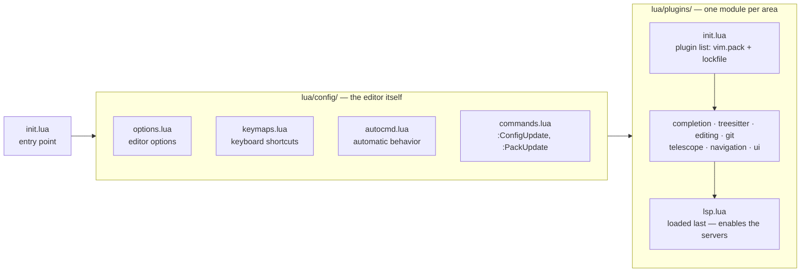

<div align="center">

# ⚡ nvim-config

### A personal [Neovim](https://neovim.io/) configuration — fast, native, reproducible.

[](https://neovim.io)
[](https://www.lua.org)
[-7aa2f7?style=for-the-badge)](https://neovim.io/doc/user/pack.html)
<br>
[](https://github.com/sombreror/nvim-config/releases)
[](https://github.com/folke/tokyonight.nvim)
[](./LICENSE)
[](https://github.com/sombreror/nvim-config/commits/main)

*Built on Neovim's native plugin manager `vim.pack` — every plugin pinned in a
lockfile, every tool auto-installed: the exact same setup restored on any
machine with one `git clone`.*

[Highlights](#highlights) •
[Installation](#installation) •
[Plugins](#plugins) •
[Keymaps](#keymaps) •
[Troubleshooting](#troubleshooting) •
[Syncing](#syncing-changes)

<br>


<sub>Press <kbd>Space</kbd> and wait: which-key · Telescope find + live grep · lazygit — the daily flow, no mouse.</sub>

</div>

---

## Highlights

| | |
| --- | --- |
| **100% native foundations** | `vim.pack` for plugins, `vim.lsp` for language servers, the experimental `vim._core.ui2` for a redesigned cmdline. No plugin-manager framework to learn. |
| **Reproducible** | [`nvim-pack-lock.json`](./nvim-pack-lock.json) pins every plugin version; Mason auto-installs **both** the language servers *and* the formatters; `:ConfigUpdate` pulls the latest config from git without leaving the editor. |
| **Web-dev ready** | LSP, Emmet, snippets and formatters for PHP, JS/TS, HTML, CSS and Python — live browser preview included. |
| **Keyboard-first, no VS Code cosplay** | No sidebar, no breadcrumbs: Telescope to find things, Harpoon to switch between hot files, Flash to jump anywhere on screen. |
| **Discoverable** | Press <kbd>Space</kbd> and *wait*: which-key pops up every keymap with its description. The config teaches itself. |

### The daily drivers

The 20% of keymaps used 80% of the time — the full list is in [Keymaps](#keymaps):

| Key | Action |
| --- | --- |
| `<leader>ff` / `<leader>fg` | Telescope — find a **file** / grep **text** in the whole project |
| `<leader>j` | Flash — type 2 chars, jump anywhere on screen |
| `<leader>a` / `<leader>1..4` | Harpoon — mark a hot file / jump straight to it |
| `<leader>gg` | LazyGit |
| `<leader>cf` | Format the buffer, then save |
| <kbd>Space</kbd> *(and wait)* | which-key — every other keymap, live |

> [!NOTE]
> Big thanks to [**kickstart.nvim**](https://github.com/nvim-lua/kickstart.nvim) —
> an invaluable guide for learning how a Neovim config is structured, and where
> a lot of the ideas here come from.

## Learning Neovim

Before reaching for the internet, use Neovim's **built-in documentation** — it is
excellent, always matches the version you are running, and is the single best
way to learn the editor.

**Help system** — every option, command and function is documented:

| Command | What it does |
| --- | --- |
| `:help` | Open the main help page |
| `:help <topic>` | Help for a specific topic, e.g. `:help vim.pack` |
| `:help <keys>` | What a key does, e.g. `:help <C-w>` or `:help :w` |
| `:helpgrep <text>` | Search the full text of all help files |
| <kbd>K</kbd> | Open help (or LSP hover docs) for the word under the cursor |
| <kbd>Ctrl</kbd><kbd>]</kbd> / <kbd>Ctrl</kbd><kbd>o</kbd> | Jump to a tag link in help / jump back |

> [!TIP]
> Inside a help buffer, links are the words wrapped in `|bars|`. Put the cursor
> on one and press <kbd>Ctrl</kbd><kbd>]</kbd> to follow it, <kbd>Ctrl</kbd><kbd>o</kbd> to go back.

**Interactive tutorial** — the fastest way to get the fundamentals into your
fingers:

```vim
:Tutor
```

`:Tutor` opens a ~30-minute hands-on lesson (movement, editing, search,
saving…). Work through it directly inside Neovim — it is the recommended
starting point for anyone new to the editor.

## Requirements

| Tool | Why |
| --- | --- |
| **Neovim 0.12+** | Required for `vim.pack` and the experimental `vim._core.ui2` UI |
| `git` | Plugin downloads and version control |
| [`lazygit`](https://github.com/jesseduffield/lazygit) | In-editor git UI (`<leader>gg`) |
| **Nerd Font** | Statusline and file-type icons |
| `ripgrep` | Text search: Telescope `live_grep` and grug-far |
| `make` + `gcc` | Compile `telescope-fzf-native` (happens automatically on install/update) |
| **Node.js** | Required by `prettierd` and the JS/TS/JSON/HTML/CSS language servers |
| `fd` *(optional)* | Faster file finding for Telescope |

## Installation

Follow the steps in order. Every command you need is listed here.

### 1. Install the system dependencies

These must be on your `PATH` **before** launching Neovim.

**Fedora** (this is the machine the config is used on):

```bash
sudo dnf install neovim git lazygit ripgrep fd-find gcc make nodejs
```

<details>
<summary><b>Other systems</b> (Debian, Arch, macOS…)</summary>

```bash
# Debian / Ubuntu
sudo apt install neovim git ripgrep fd-find gcc make nodejs
#   lazygit: see https://github.com/jesseduffield/lazygit#installation

# Arch / Manjaro
sudo pacman -S neovim git lazygit ripgrep fd gcc make nodejs

# openSUSE
sudo zypper install neovim git lazygit ripgrep fd gcc make nodejs

# Void Linux
sudo xbps-install -S neovim git lazygit ripgrep fd gcc make nodejs

# Alpine
sudo apk add neovim git lazygit ripgrep fd gcc make nodejs

# Gentoo
sudo emerge app-editors/neovim dev-vcs/git dev-tools/lazygit sys-apps/ripgrep sys-apps/fd gcc make nodejs

# Nix (any distro)
nix-env -iA nixpkgs.neovim nixpkgs.git nixpkgs.lazygit nixpkgs.ripgrep nixpkgs.fd nixpkgs.gcc nixpkgs.gnumake nixpkgs.nodejs

# macOS (Homebrew)
brew install neovim git lazygit ripgrep fd gcc make node
```
</details>

> [!IMPORTANT]
> **Neovim 0.12+ is required**. If your package manager ships an older version,
> install a newer build from <https://github.com/neovim/neovim/releases>.

Also install a **[Nerd Font](https://www.nerdfonts.com/)** and select it in
your terminal, otherwise the statusline and file-type icons render as boxes.

### 2. Clone the repo

```bash
git clone git@github.com:sombreror/nvim-config.git ~/.config/nvim
```

> [!WARNING]
> If `~/.config/nvim` already exists, back it up first:
> ```bash
> mv ~/.config/nvim ~/.config/nvim.bak
> ```

### 3. First launch — everything downloads itself

```bash
nvim
```

On the first launch, **automatically**:

- `vim.pack` downloads every plugin at the exact versions pinned in
  [`nvim-pack-lock.json`](./nvim-pack-lock.json);
- Mason installs the [language servers](#language-servers) **and** the
  [formatters](#formatting);
- `tree-sitter-manager` installs the Treesitter parsers;
- the `telescope-fzf-native` native sorter is compiled (and re-compiled on
  every update of the plugin — no manual `make` needed, ever).

Wait for it to finish, then quit with `:qa`.

### 4. Done

Restart Neovim. Everything should now work — verify with `:checkhealth` if
something looks off.

## Structure

One file per area: options, keymaps and autocmds live under `config/`, every
plugin is set up in its own themed module under `plugins/`. The arrows show
the **load order** at startup:



<details>
<summary><b>Classic tree view</b> — every file and what it does</summary>

```
.
├── init.lua                  # Entry point — loads everything below
├── nvim-pack-lock.json       # Pinned plugin versions (reproducible installs)
├── snippets/                 # Custom snippets, loaded by blink.cmp
└── lua/
    ├── config/
    │   ├── options.lua        # Editor options
    │   ├── keymaps.lua        # All keyboard shortcuts
    │   ├── autocmd.lua        # Automatic editor behavior
    │   └── commands.lua       # Custom user commands (:ConfigUpdate)
    └── plugins/
        ├── init.lua           # Plugin list (vim.pack) — loads the modules below
        ├── completion.lua     # blink.cmp + lazydev source
        ├── treesitter.lua     # Treesitter parsers (tree-sitter-manager)
        ├── editing.lua        # conform, autopairs, mini.*, todo-comments, grug-far
        ├── git.lua            # gitsigns + hunk keymaps
        ├── telescope.lua      # Telescope + fzf + file browser
        ├── navigation.lua     # flash, harpoon, which-key
        ├── ui.lua             # tokyonight, lualine, nvim-notify, highlight-colors
        └── lsp.lua            # Mason + servers + formatters + lazydev (loaded last)
```
</details>

## Plugins

### LSP & completion

| Plugin | What it does |
| --- | --- |
| **nvim-lspconfig** + **mason** + **mason-lspconfig** | Install and enable the language servers |
| **mason-tool-installer** | Auto-installs the formatters too — nothing to install by hand |
| **blink.cmp** + **friendly-snippets** | Autocompletion and snippets (`super-tab`: accept with <kbd>Tab</kbd>) |
| **lazydev.nvim** | Completion and docs for the Neovim API (`vim.*`) when editing this very config |

### Editing

| Plugin | What it does |
| --- | --- |
| **tree-sitter-manager** | Treesitter parsers, auto-installed |
| **nvim-autopairs** | Auto-closes brackets and quotes (treesitter-aware) |
| **conform.nvim** | Code formatting, one formatter per language (manual — see [Formatting](#formatting)) |
| **mini.ai** | Smarter textobjects: `vif` = inside function, `via` = inside argument, `viq` = inside quotes |
| **mini.surround** | Add / change / delete surrounding pairs (`sa` / `sd` / `sr`) |
| **mini.move** | Move lines and selections with <kbd>Alt</kbd><kbd>hjkl</kbd> |
| **mini.trailspace** | Highlights trailing whitespace; trim on demand with `<leader>cw` (no silent edits on save) |
| **todo-comments.nvim** | Highlights `TODO` / `FIXME` / `HACK` / `WARN` / `NOTE` and lists them with Telescope (`<leader>ft`) |

### Search & navigation

| Plugin | What it does |
| --- | --- |
| **telescope** + **telescope-fzf-native** | Fuzzy finder for files, text and git, with a native (C) sorter |
| **telescope-file-browser** | Browse *and* edit the filesystem: create / rename / move / delete files (`<leader>fe`) |
| **flash.nvim** | Jump anywhere on screen with 2 characters + a label (`<leader>j`); also upgrades `f`/`F`/`t`/`T` |
| **harpoon** | Bookmark the 3-4 files you are working on and switch with one key (`<leader>a` / `<leader>1..4`) |
| **grug-far.nvim** | Project-wide search & replace powered by ripgrep, with a live editable preview (`<leader>sr`) |
| **which-key.nvim** | Press <kbd>Space</kbd> and wait: popup with every keymap and what it does |

<div align="center">
<br>


<sub>Telescope's find_files with the grep preview — fuzzy matching over the whole project.</sub>
<br><br>
</div>

### Git

| Plugin | What it does |
| --- | --- |
| **gitsigns** | Change markers in the gutter + hunk actions: jump (`]c` / `[c`), preview, stage and reset hunks — even just the selected lines — plus toggleable inline blame, all without leaving the file |
| **lazygit.nvim** | Full git UI inside Neovim (`<leader>gg`) |

### Web development

| Plugin | What it does |
| --- | --- |
| **live-preview.nvim** | `:LivePreview start` serves the current HTML/CSS/JS or Markdown file in the browser and hot-reloads it on every save. No Node, no extensions. *(Static files only — PHP still needs `php -S localhost:8000`.)* |
| **nvim-highlight-colors** | Shows `#ff5500`, `rgb()`, `hsl()`… as the actual color, inline |

### Appearance

| Plugin | What it does |
| --- | --- |
| **tokyonight** | Color scheme (`night` style, matched to the terminal) |
| **lualine** + **nvim-web-devicons** | Statusline with mode, git branch, diagnostics, selection/search counters and file icons |
| **nvim-notify** | `vim.notify()` as compact popups in the top-right corner, border colored by level: 🔴 error, 🟡 warning, 🟢 ok (`:Notifications` shows the history) |

> [!CAUTION]
> `noice.nvim` must **not** be added — it conflicts with the native
> `vim._core.ui2` UI already enabled in `init.lua`.

## Language servers

All auto-installed via Mason on the first launch:

| Server | Covers |
| --- | --- |
| `lua_ls` | Lua *(+ the Neovim API, via lazydev)* |
| `pyright` | Python |
| `ts_ls` | JavaScript / TypeScript |
| `eslint` | JS/TS linting *(apply the fixes with `<leader>ce`)* |
| `intelephense` | PHP |
| `html` | HTML |
| `cssls` | CSS / SCSS / Less |
| `emmet_language_server` | Emmet abbreviations for HTML/CSS |
| `jsonls` | JSON *(`package.json`, configs…)* |

> [!TIP]
> The `html` and `emmet_language_server` servers are also attached to `.php`
> files, so HTML completion and Emmet abbreviations (e.g. `!` + <kbd>Tab</kbd>) work
> inside PHP files with embedded HTML. PHP itself is still handled by
> `intelephense`.

## Formatting

Handled by **conform.nvim**. Formatting is **not run on save** — it is
triggered manually with `<leader>cf`, which formats the buffer (or the visual
selection) and then writes the file. This keeps `:w` instant and lets you save
without reformatting when you don't want to.

| Language | Formatter |
| --- | --- |
| Lua | `stylua` |
| Python | `black` |
| JS / TS / JSON | `biome` *(falls back to `prettierd`)* |
| HTML / CSS / SCSS | `prettierd` |
| PHP | `php-cs-fixer` *(needs a `composer.json` in the project)* |

> [!NOTE]
> All the formatters are **installed automatically** by
> `mason-tool-installer` on the first launch — nothing to do by hand.

- `biome` is a Rust formatter (no Node.js) — it formats JS/TS/JSON
  near-instantly; `prettierd` keeps a daemon running so HTML/CSS stay fast
  after the first call.
- ESLint fixes are separate from formatting: `<leader>ce` applies every
  auto-fixable lint problem in the current JS/TS buffer.

## Editor behavior

Automatic behavior configured in `autocmd.lua`:

- Yanked (copied) text is briefly highlighted.
- The cursor returns to its last position when you reopen a file.
- Files changed outside Neovim (lazygit, `git checkout`…) are reloaded
  automatically — with a notification telling you *which* file was reloaded.
- The terminal opens with no line numbers, already in insert mode.
- Splits are re-balanced when the terminal window is resized.
- Comment leaders are **not** auto-continued when you start a new line.
- Trailing whitespace is highlighted (mini.trailspace) and trimmed manually
  with `<leader>cw` — never silently on save.

## Keymaps

Leader is <kbd>Space</kbd>. **Press <kbd>Space</kbd> and wait** — which-key
shows everything below, live.

### Find (Telescope)

| Key | Action |
| --- | --- |
| `<leader>ff` | Find **files** (project root) |
| `<leader>fg` | Live grep — search **text** in the whole project |
| `<leader>fe` | File browser — current file's directory |
| `<leader>fb` | Open buffers |
| `<leader>fr` | Resume the last picker |
| `<leader>ft` | TODO comments |
| `<leader>fh` | Search the Neovim help |
| `<leader>fd` | All diagnostics of the project (errors, warnings…) |
| `<leader>fs` | Symbols in the current file (functions, classes…) |

### Jump & switch

| Key | Action |
| --- | --- |
| `<leader>j` | Flash — type 2 chars, jump anywhere on screen |
| `<leader>J` | Flash — select the treesitter node under the cursor |
| `f` / `t` *(+ char)* | Native motions, upgraded by Flash with jump labels |
| `<leader>a` | Harpoon — add the current file |
| `<leader>h` | Harpoon — open the menu (edit / reorder the list) |
| `<leader>1..4` | Harpoon — jump straight to file 1..4 |

### Git

| Key | Action |
| --- | --- |
| `<leader>gg` | Open LazyGit |
| `]c` / `[c` | Next / previous change (hunk) in the file |
| `<leader>gp` | Preview the hunk under the cursor (see the diff) |
| `<leader>ga` | Stage the hunk (`git add` just that change) |
| `<leader>gr` | Reset the hunk (discard that change) |
| `<leader>ga` *(visual)* | Stage **only the selected lines** of a hunk |
| `<leader>gr` *(visual)* | Reset **only the selected lines** of a hunk |
| `<leader>gB` | Toggle inline blame — author + date of the current line |
| `<leader>gs` | Telescope — git status |
| `<leader>gc` | Telescope — git commits |
| `<leader>gb` | Telescope — git branches |

### LSP & code

The LSP keymaps below activate **per buffer** when a language server attaches
(`LspAttach`) — in buffers without a server, the native `gd` / `grr` keep
their default behavior.

| Key | Action |
| --- | --- |
| `gd` | Go to definition |
| <kbd>K</kbd> | Hover documentation *(native)* |
| `grr` | References of the symbol, in a Telescope picker |
| `<leader>cr` | Rename the symbol in the whole project |
| `<leader>ca` | Code action — fix, refactor… *(also in visual)* |
| `<leader>ce` | ESLint — fix all auto-fixable problems (JS/TS) |
| `<leader>e` | Show diagnostic under cursor |
| `<leader>cf` | Format buffer / selection, then save |
| `<leader>cw` | Trim trailing whitespace + empty last lines |
| `<leader>sr` | Search & replace in the whole project (grug-far) |

### Editing

| Key | Action |
| --- | --- |
| `sa` / `sd` / `sr` | Add / delete / replace surrounding pair (mini.surround) |
| `vif` / `via` / `viq` | Select inside function / argument / quotes (mini.ai) |
| <kbd>Alt</kbd><kbd>h/j/k/l</kbd> | Move line or selection (mini.move) |
| `p` *(visual)* | Paste without overwriting the register |
| <kbd>Esc</kbd> | Clear search highlight |

### Windows & terminal

| Key | Action |
| --- | --- |
| `<leader>r` | Vertical split |
| <kbd>Ctrl</kbd><kbd>h/j/k/l</kbd> | Move to the split left / down / up / right |
| `<leader>t` | Open the terminal inside Neovim |
| <kbd>Esc</kbd><kbd>Esc</kbd> *(terminal)* | Back to normal mode |

## Commands

| Command | What it does |
| --- | --- |
| `:ConfigUpdate` | Pull the latest config from git, right from inside Neovim |
| `:PackUpdate` | Update all plugins — review buffer, `:write` to apply |
| `:LivePreview start` / `close` | Live browser preview of the current HTML/MD file |
| `:GrugFar` | Project-wide search & replace panel |
| `:Notifications` | History of the notification popups |
| `:Mason` | Manage language servers and formatters |
| `:TSInstall <lang>` | Install an extra Treesitter parser |

## Adding a plugin

1. Add the repo URL to the `vim.pack.add` list in
   [`lua/plugins/init.lua`](./lua/plugins/init.lua), with a one-line comment
   saying what it does.
2. Configure it in the themed module it belongs to (`plugins/editing.lua`,
   `plugins/ui.lua`…) — or create a new module and `require` it at the bottom
   of `plugins/init.lua`.
3. Restart Neovim: `vim.pack` installs it automatically. Then **commit the
   updated [`nvim-pack-lock.json`](./nvim-pack-lock.json)** so every other
   machine gets the same plugin at the same version.

> [!TIP]
> To remove a plugin, delete its URL and its setup, then run
> `:lua vim.pack.del({ "plugin-name" })` to wipe it from disk too.

## Troubleshooting

| Symptom | Fix |
| --- | --- |
| Icons render as boxes or `?` | The terminal is not using a **Nerd Font** — install one and select it in the terminal profile |
| A warning says the fzf sorter is not built, search feels slow | The automatic build failed — make sure `make` and `gcc` are installed, then run `make -C ~/.local/share/nvim/site/pack/core/opt/telescope-fzf-native.nvim` and restart |
| A formatter or language server is missing | Open `:Mason` and check it is installed — `:MasonLog` shows why an install failed |
| Anything else looks off | `:checkhealth` — it inspects this whole config, plugin by plugin |

## Syncing changes

The whole point of this repo is that the config is the same on every machine.

**After editing on one machine**, push your changes:

```bash
git add -A
git commit -m "describe your changes"
git push
```

**On any other machine**, just run `:ConfigUpdate` from inside Neovim — no need
to leave the editor or remember git commands:

```vim
:ConfigUpdate
```

It runs `git pull --rebase --autostash` against this repo, so it:

- **never freezes the editor** — git runs asynchronously in the background;
- **keeps your local edits safe** — uncommitted changes are auto-stashed
  before the pull and restored after it (`--autostash`);
- **tells you exactly what happened** — *already up to date*, *updated*, or
  the git error, as a notification popup (🟢 / 🟡 / 🔴).

> [!IMPORTANT]
> After an update Neovim is still running the **old** config it loaded at
> startup. **Restart Neovim** to apply the new version — `:restart` does it
> in one step.

The equivalent from a terminal, if you prefer:

```bash
git -C ~/.config/nvim pull
```

### Updating the plugins

The lockfile keeps the plugins **pinned** — they never move on their own. When
*you* decide to update them:

```vim
:PackUpdate
```

It opens a review buffer with the changelog of every plugin that has a newer
version: apply with `:write`, or discard with `:q`.

> [!TIP]
> Applying also refreshes [`nvim-pack-lock.json`](./nvim-pack-lock.json) —
> **commit it** so every other machine gets the same plugin versions on the
> next `:ConfigUpdate`.

### Versioning

Milestones are tagged and published on the
[**Releases page**](https://github.com/sombreror/nvim-config/releases) — the
history of the project at a glance, from the first usable setup to the
current version. Note that `:ConfigUpdate` always follows the tip of `main`,
not the latest release.

## Uninstalling

Neovim keeps files in four places. To remove this config and everything it
installed:

```bash
rm -rf ~/.config/nvim          # the config itself (this repo)
rm -rf ~/.local/share/nvim     # plugins, language servers, formatters, parsers
rm -rf ~/.local/state/nvim     # undo history, logs
rm -rf ~/.cache/nvim           # temporary caches
```

## License

Released under the [MIT License](./LICENSE).

---

<div align="center">

*Made with Lua and Neovim — [sombreror](https://github.com/sombreror)*

</div>
